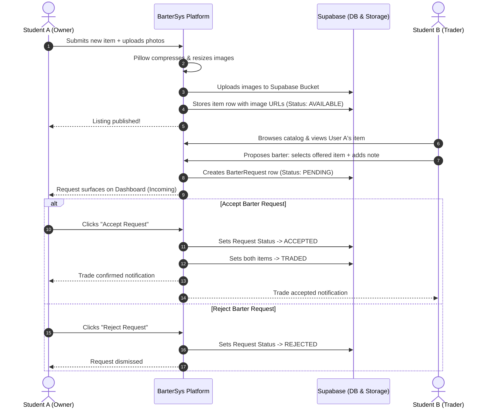
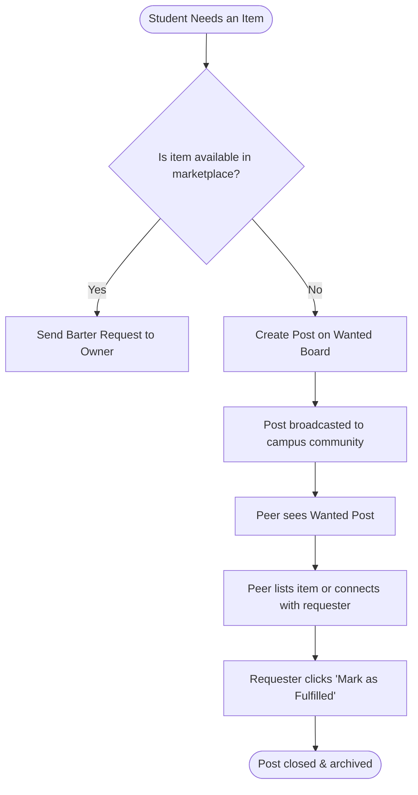

# BarterSys 🔄

> **Trade what you have. Get what you need.**  
> A cashless, student-to-student bartering platform built with a bold Bauhaus & Neo-brutalist aesthetic.

---

## 📑 Table of Contents

1. [Overview](#1-overview)
2. [Project Structure](#2-project-structure)
3. [Features](#3-features)
4. [API Points Table](#4-api-points-table)
5. [Preview (for Screenshots)](#5-preview-for-screenshots)
6. [Workflow (Flow Chart)](#6-workflow-flow-chart)
7. [Tech Stack](#7-tech-stack)
8. [Local Deploy](#8-local-deploy)

---

## 1. Overview

**BarterSys** is a campus and hostel bartering platform designed to facilitate cashless, direct item-for-item exchanges among students. Whether it's course textbooks, lab equipment, dorm appliances, electronics, or fitness gear, BarterSys empowers students to trade items they no longer use for goods they actually need—eliminating cash barriers and promoting sustainability within university communities.

### Key Highlights
- **Cashless Trade Economy:** Pure item-for-item swaps with counter-proposals and custom messages.
- **Wanted Board:** Community bulletin board where students broadcast requests for items they are looking for.
- **Neo-brutalist & Bauhaus UI:** High-contrast geometric design featuring bold primary accents (`#D02020`, `#1040C0`, `#F0C020`), thick borders, and hard-edged drop shadows.
- **Optimized Cloud Media:** Client and server-side image processing with Pillow (downscaling to 1200px max, progressive JPEG compression) directly synchronized with Supabase Cloud Storage.
- **Clean Architecture:** Modular Flask application factory pattern with Blueprints, SQLAlchemy ORM, WTForms validation, and CSRF protection.

---

## 2. Project Structure

```
ucs503p-202526odd-team-void/
│
├── app/
│   ├── __init__.py          # App factory, extension initializations, and blueprint registrations
│   ├── config.py            # Development and Production configuration settings
│   ├── forms.py             # Flask-WTF form definitions (Auth, Items, Requests, Wanted)
│   ├── models.py            # SQLAlchemy models (User, Hostel, Item, ItemImage, BarterRequest, ItemRequest)
│   ├── storage.py           # Supabase Storage helper & Pillow image compression pipeline
│   │
│   └── routes/              # Modular Flask Blueprint controllers
│       ├── __init__.py
│       ├── auth.py          # Signup, Login, Logout route handlers
│       ├── dashboard.py     # Unified user dashboard (active items, incoming/sent requests)
│       ├── items.py         # Item CRUD, image upload processing & storage cleanup
│       ├── main.py          # Public marketplace catalog & index landing
│       ├── requests.py      # Barter request lifecycle (send, review, accept, reject)
│       └── wanted.py        # Wanted Board (post, browse, mark fulfilled)
│
├── static/
│   ├── css/
│   │   └── main.css         # Neo-brutalist utility classes, buttons, badge styling
│   ├── js/                  # Clientside interactions and scripts
│   └── images/              # Static icons, mock assets, and screenshots
│
├── templates/               # Jinja2 template hierarchy
│   ├── base.html            # Core HTML shell with responsive Bauhaus navbar & footer
│   ├── auth/                # Login & registration views
│   ├── dashboard/           # User dashboard view
│   ├── items/               # New, edit, and detail views for listings
│   ├── macros/              # Reusable Jinja components & form macros
│   ├── main/                # Marketplace browse view
│   ├── requests/            # Sent, incoming, and trade proposal views
│   └── wanted/              # Wanted board catalog and creation views
│
├── .env.example             # Template for required environment variables
├── .gitignore               # Ignored files, virtual environments, and secrets
├── requirements.txt         # Project Python dependencies
└── run.py                   # Development entrypoint & CLI database management (`init-db`)
```

---

## 3. Features

### 🔐 User Authentication & Profiles
- **Secure Password Hashing:** Powered by `werkzeug.security` with strong salt-generation.
- **Persistent Sessions:** Remember-me functionality via `flask-login`.
- **Form Validation & CSRF Protection:** Robust validation with WTForms and automated CSRF token checks.

### 📦 Item Listings & Cloud Media Management
- **Detailed Listings:** Add title, comprehensive description, category, and condition (e.g., *Brand New*, *Like New*, *Fair*).
- **Multi-Image Upload:** Upload up to 5 images per item with automated validation (`JPEG`, `PNG`, `WEBP`).
- **On-the-Fly Image Optimization:** Pillow resizes images to a maximum of 1200px and compresses to quality JPEG buffers before cloud upload.
- **Supabase Storage Integration:** Direct upload to Supabase Storage with public CDN URLs saved to PostgreSQL.
- **Automatic Storage Cleanup:** Deleting a listing automatically purges associated binary objects from Supabase Storage.

### 🔄 Barter Trade System
- **Item-for-Item Proposals:** Users select an available item from their own inventory to propose in exchange.
- **Direct Messaging:** Attach a custom negotiation note to explain the trade offer.
- **Self-Trade Prevention:** Guard rails prevent users from requesting their own listings.
- **Instant Status Transition:** Accepting an exchange automatically flags both offered and requested items as `TRADED`.
- **Request Lifecycle Tracking:** Real-time incoming, sent, pending, accepted, and rejected state tracking.

### 📌 Wanted Board
- **Looking-for Broadcasts:** Post items you actively need that are not yet listed on the marketplace.
- **1-Click Fulfillment:** Mark wanted requests as fulfilled once another student helps out.

### 📊 Unified Student Dashboard
- Single-pane view of:
  - Your active and traded items.
  - Incoming barter requests requiring your review.
  - Outgoing trade proposals waiting for approval.
  - Active wanted board requests.

---

## 4. API Points Table

| Blueprint | Method | URL / Endpoint | Auth Required | Description / Action |
| :--- | :--- | :--- | :---: | :--- |
| **`main`** | `GET` | `/` | ❌ No | Browse all available public listings sorted by newest first. |
| **`auth`** | `GET`, `POST` | `/signup` | ❌ No | Register a new user account with name, email, and password. |
| **`auth`** | `GET`, `POST` | `/login` | ❌ No | Authenticate user credentials and create login session. |
| **`auth`** | `GET` | `/logout` | ✅ Yes | Invalidate user session and redirect to marketplace home. |
| **`items`** | `GET`, `POST` | `/items/new` | ✅ Yes | Create a new listing and upload up to 5 compressed images. |
| **`items`** | `GET` | `/items/<int:item_id>` | ❌ No | View full item specification, image gallery, and seller info. |
| **`items`** | `GET`, `POST` | `/items/<int:item_id>/edit` | ✅ Yes (Owner) | Modify listing details and append additional photos. |
| **`items`** | `POST` | `/items/<int:item_id>/delete` | ✅ Yes (Owner) | Delete listing and purge all associated storage objects. |
| **`requests`** | `GET`, `POST` | `/requests/send/<int:item_id>` | ✅ Yes | Submit a barter offer offering an item and trade note. |
| **`requests`** | `GET` | `/requests/incoming` | ✅ Yes | View all barter requests received for current user's items. |
| **`requests`** | `GET` | `/requests/sent` | ✅ Yes | View all barter requests proposed by current user. |
| **`requests`** | `POST` | `/requests/<int:req_id>/accept` | ✅ Yes (Owner) | Accept barter offer; marks involved items as `TRADED`. |
| **`requests`** | `POST` | `/requests/<int:req_id>/reject` | ✅ Yes (Owner) | Decline barter offer and set status to `REJECTED`. |
| **`wanted`** | `GET` | `/wanted/` | ❌ No | Browse all active, unfulfilled community wanted requests. |
| **`wanted`** | `GET`, `POST` | `/wanted/new` | ✅ Yes | Publish a new "Wanted" post looking for specific items. |
| **`wanted`** | `POST` | `/wanted/<int:post_id>/fulfill` | ✅ Yes (Owner) | Mark a wanted post as fulfilled. |
| **`dashboard`**| `GET` | `/dashboard/` | ✅ Yes | View current user's listings, incoming/sent trades, and posts. |

---

## 5. Preview (for Screenshots)

> Place your application screenshot files in `static/images/screenshots/` to display live UI captures in this section.

### Marketplace & Item Discovery

*Browse available student listings with category filters and Neo-brutalist card styling.*

---

### Item Detail & Barter Action

*Detailed product view featuring multi-image carousel and quick barter proposal actions.*

---

### Trade Offer Creation

*Propose an exchange by selecting an item from your own inventory with a personalized message.*

---

### Unified Dashboard

*Track incoming trade proposals, outgoing requests, active listings, and wanted posts.*

---

### Community Wanted Board

*Broadcast and discover wanted item requests across campus hostels.*

---

## 6. Workflow (Flow Chart)

### Barter Exchange Lifecycle



---

### Wanted Board & Fulfillment Flow



---

## 7. Tech Stack

| Category | Technology | Description |
| :--- | :--- | :--- |
| **Backend Framework** | **Flask 3.0+** | Python microframework utilizing application factories & blueprints |
| **ORM / Database Layer** | **Flask-SQLAlchemy 3.1+** | Relational mapping, models, relationships, and queries |
| **Authentication** | **Flask-Login 0.6+** | Session management, login protection, and current_user context |
| **Forms & Security** | **Flask-WTF 1.2+ / WTForms** | Form definitions, CSRF protection, and field validators |
| **Primary Database** | **Supabase PostgreSQL** | Cloud PostgreSQL with pooled connection string via Supavisor |
| **Local DB Fallback** | **SQLite** | Zero-setup lightweight database for offline local development |
| **Object Storage** | **Supabase Storage** | S3-compatible cloud bucket storing item listing pictures |
| **Image Processing** | **Pillow 10.0+ (PIL)** | Image downscaling (1200px max) & progressive JPEG compression |
| **Frontend Styling** | **Tailwind CSS & Vanilla CSS** | Neo-brutalist / Bauhaus design system with custom shadow utilities |
| **Typography** | **Google Fonts (Outfit)** | Clean, geometric sans-serif modern typography |
| **Template Engine** | **Jinja2** | Server-side template rendering with reusable macros |
| **WSGI Server** | **Gunicorn 21.0+** | Production HTTP WSGI server for cloud deployment (Render) |

---

## 8. Local Deploy

Follow these steps to run the BarterSys platform locally on your machine.

### Prerequisites
- **Python 3.10+** installed
- **Git** installed
- *(Optional)* A free **Supabase** account (if using cloud Postgres and Storage)

---

### Step 1: Clone the Repository
```bash
git clone https://github.com/your-username/ucs503p-202526odd-team-void.git
cd ucs503p-202526odd-team-void
```

---

### Step 2: Create and Activate a Virtual Environment

- **Windows (PowerShell):**
  ```powershell
  python -m venv .venv
  .venv\Scripts\Activate.ps1
  ```

- **Linux / macOS:**
  ```bash
  python3 -m venv .venv
  source .venv/bin/activate
  ```

---

### Step 3: Install Dependencies
```bash
pip install --upgrade pip
pip install -r requirements.txt
```

---

### Step 4: Configure Environment Variables

Create your local `.env` file by copying the template:

```bash
# Windows
copy .env.example .env

# Linux / macOS
cp .env.example .env
```

Open `.env` and fill in your settings:

```dotenv
FLASK_ENV=development
FLASK_APP=run.py
SECRET_KEY=your-super-secret-key-change-this

# Option A: Local SQLite (Fastest for testing)
SUPABASE_DB_URL=sqlite:///dev.db

# Option B: Supabase Postgres (Connection Pooling)
# SUPABASE_DB_URL=postgresql://postgres.<project-ref>:<db-password>@<pooler-host>:6543/postgres

# Supabase Storage (Required for image uploads)
SUPABASE_URL=https://<your-project-ref>.supabase.co
SUPABASE_KEY=your-supabase-anon-or-service-key
SUPABASE_BUCKET=item-images
```

> **Note on Storage:** In Supabase, make sure to create a storage bucket named `item-images` (or matching `SUPABASE_BUCKET`) and ensure public access is enabled for image reading.

---

### Step 5: Initialize the Database

Run the custom Flask CLI command to create all database tables:

```bash
flask --app run.py init-db
```
*Expected output: `Database tables created.`*

---

### Step 6: Launch the Development Server

```bash
python run.py
```

The application will start on:
```
http://127.0.0.1:5000/
```

Open your browser and navigate to `http://127.0.0.1:5000/` to explore BarterSys!
