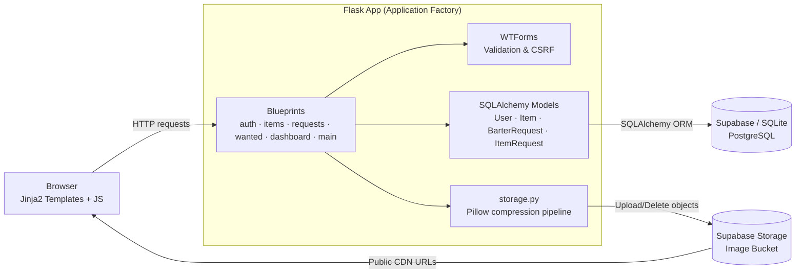
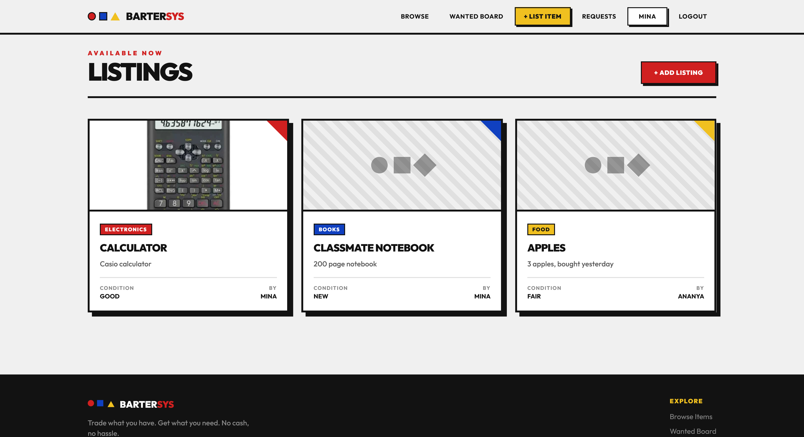
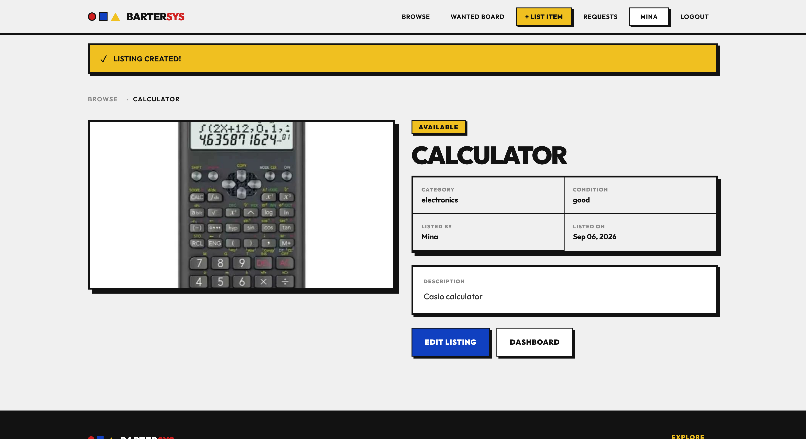
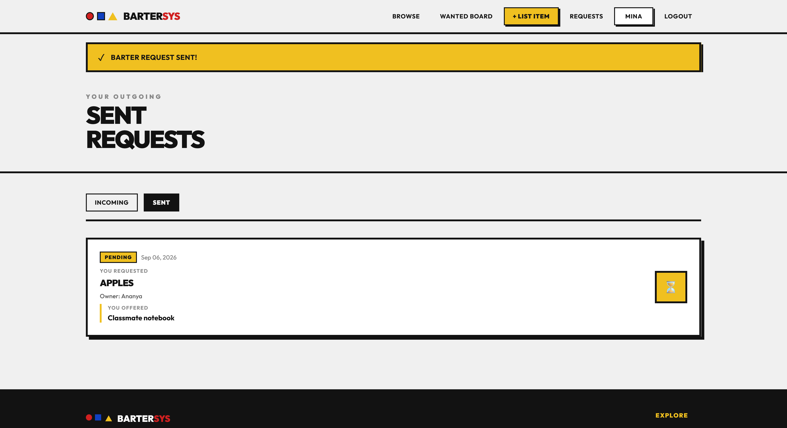
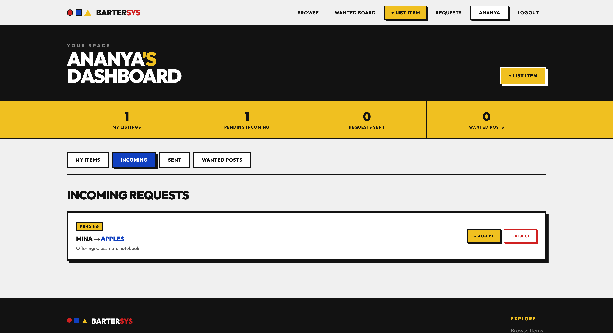
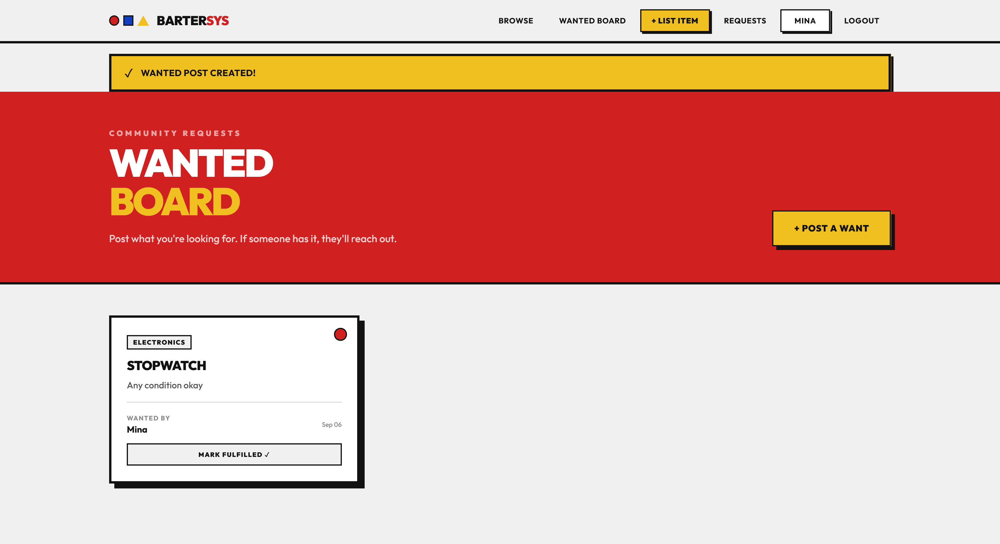
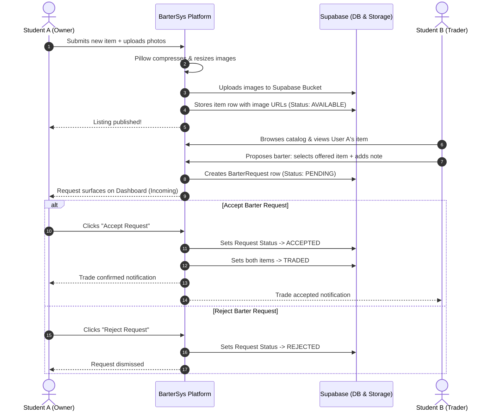

# BarterSys 🔄

> **Trade what you have. Get what you need.**  
> A cashless, student-to-student bartering platform built with a bold Bauhaus & Neo-brutalist aesthetic.
> [Deployed on Render](https://bartersys.onrender.com/)

---

## 📑 Table of Contents

1. [Overview](#1-overview)
2. [System Architecture](#2-system-architecture)
3. [Features](#3-features)
4. [API Endpoints](#4-api-endpoints)
5. [Preview](#5-preview-for-screenshots)
6. [Workflow](#6-workflow)
7. [Tech Stack](#7-tech-stack)
8. [Project Structure](#8-project-structure)
9. [Local Deploy](#9-local-deploy)

---

## 1. Overview

**BarterSys** is a campus and hostel bartering platform designed to facilitate cashless, direct item-for-item exchanges among students. Whether it's course textbooks, lab equipment, dorm appliances, electronics, or fitness gear, BarterSys empowers students to trade items they no longer use for goods they actually need—eliminating cash barriers and promoting sustainability within university communities.

### Key Highlights
- **Cashless Trade Economy:** Pure item-for-item swaps with counter-proposals and custom messages.
- **Wanted Board:** Community bulletin board where students broadcast requests for items they are looking for.
- **Neo-brutalist & Bauhaus UI:** High-contrast geometric design featuring bold primary accents (`#D02020`, `#1040C0`, `#F0C020`), thick borders, and hard-edged drop shadows.
- **Optimized Cloud Media:** Client and server-side image processing with Pillow (downscaling to 1200px max, progressive JPEG compression) directly synchronized with Supabase Cloud Storage.
- **Clean Architecture:** Modular Flask application factory pattern with Blueprints, SQLAlchemy ORM, WTForms validation, and CSRF protection.

---

### 2. System Architecture



*Requests flow through Flask Blueprints, get validated by WTForms, and are persisted via SQLAlchemy to Postgres (or SQLite locally). Images are compressed by Pillow and pushed to Supabase Storage, which serves them back to the client over its CDN.*

---
## 3. Features

### 🔐 Authentication & Security
- Secure signup/login with password hashing (`Werkzeug`), session persistence (`Flask-Login`), and CSRF validation (`WTForms`).

### 📦 Listings & Cloud Media
- Multi-image uploads (up to 5) with automatic Pillow optimization (downscaled to 1200px, JPEG compressed).
- Direct Supabase CDN storage integration with automatic asset cleanup upon listing deletion.

### 🔄 Barter Trade System
- Direct item-for-item proposals with negotiation notes and self-trade prevention.
- Real-time trade lifecycle tracking (pending, accepted, rejected) with automatic `TRADED` status updates on acceptance.

### 📌 Wanted Board
- Campus bulletin to broadcast requests for unlisted items and mark them fulfilled in one click.

### 📊 Unified Dashboard
- Centralized management of active listings, incoming/sent barter requests, and wanted posts.

---

## 4. API Endpoints 

| Blueprint | Endpoints | Auth | Description |
| :--- | :--- | :---: | :--- |
| **`main`** | `GET /` | ❌ | Public marketplace catalog. |
| **`auth`** | `/signup`, `/login`, `/logout` | Mixed | Registration, login, and session handling. |
| **`items`** | `/items/new`, `/items/<id>`, `/items/<id>/edit`, `/items/<id>/delete` | Mixed | Full CRUD for listings, including image upload/cleanup. |
| **`requests`** | `/requests/send/<id>`, `/incoming`, `/sent`, `/<id>/accept`, `/<id>/reject` | ✅ | Barter request lifecycle: propose, review, accept, or reject. |
| **`wanted`** | `/wanted/`, `/wanted/new`, `/wanted/<id>/fulfill` | Mixed | Browse, post, and resolve Wanted Board requests. |
| **`dashboard`** | `GET /dashboard/` | ✅ | Unified view of a user's items, requests, and posts. |

*"Mixed" auth means some routes in that group are public (e.g. browsing/viewing) while create, edit, and owner-only actions require login.*

---

## 5. Preview 

### Marketplace & Item Discovery

*Browse available student listings with category filters and Neo-brutalist card styling.*

---

### Item Detail & Barter Action

*Detailed product view featuring multi-image carousel and quick barter proposal actions.*

---

### Trade Offer Creation

*Propose an exchange by selecting an item from your own inventory with a personalized message.*

---

### Unified Dashboard

*Track incoming trade proposals, outgoing requests, active listings, and wanted posts.*

---

### Community Wanted Board

*Broadcast and discover wanted item requests across campus hostels.*

---

## 6. Workflow 

### Barter Exchange Lifecycle



---

## 7. Tech Stack

| Layer | Technology |
| :--- | :--- |
| **Backend** | Flask 3.0+ (app factory & blueprints), Flask-Login, Flask-WTF/WTForms |
| **Database** | Supabase PostgreSQL (prod) via Flask-SQLAlchemy, SQLite (local dev) |
| **Media** | Pillow (resize/compress) + Supabase Storage (CDN-backed bucket) |
| **Frontend** | Jinja2, Tailwind CSS & vanilla CSS (Neo-brutalist/Bauhaus), Google Fonts (Outfit) |
| **Deployment** | Gunicorn on Render |

---

## 8. Project Structure

```
bartersys/
│
├── app/
│   ├── __init__.py          # App factory, extension initializations, and blueprint registrations
│   ├── config.py            # Development and Production configuration settings
│   ├── forms.py             # Flask-WTF form definitions (Auth, Items, Requests, Wanted)
│   ├── models.py            # SQLAlchemy models (User, Hostel, Item, ItemImage, BarterRequest, ItemRequest)
│   ├── storage.py           # Supabase Storage helper & Pillow image compression pipeline
│   │
│   └── routes/              # Modular Flask Blueprint controllers
│       ├── __init__.py
│       ├── auth.py          # Signup, Login, Logout route handlers
│       ├── dashboard.py     # Unified user dashboard (active items, incoming/sent requests)
│       ├── items.py         # Item CRUD, image upload processing & storage cleanup
│       ├── main.py          # Public marketplace catalog & index landing
│       ├── requests.py      # Barter request lifecycle (send, review, accept, reject)
│       └── wanted.py        # Wanted Board (post, browse, mark fulfilled)
│
├── static/
│   ├── css/
│   │   └── main.css         # Neo-brutalist utility classes, buttons, badge styling
│   ├── js/                  # Clientside interactions and scripts
│   └── images/              # Static icons, mock assets, and screenshots
│
├── templates/               # Jinja2 template hierarchy
│   ├── base.html            # Core HTML shell with responsive Bauhaus navbar & footer
│   ├── auth/                # Login & registration views
│   ├── dashboard/           # User dashboard view
│   ├── items/               # New, edit, and detail views for listings
│   ├── macros/              # Reusable Jinja components & form macros
│   ├── main/                # Marketplace browse view
│   ├── requests/            # Sent, incoming, and trade proposal views
│   └── wanted/              # Wanted board catalog and creation views
│
├── .env.example             # Template for required environment variables
├── .gitignore               # Ignored files, virtual environments, and secrets
├── requirements.txt         # Project Python dependencies
└── run.py                   # Development entrypoint & CLI database management (`init-db`)
```
---
## 9. Local Deploy

Follow these steps to run the BarterSys platform locally on your machine.

### Prerequisites
- **Python 3.10+** installed
- **Git** installed
- *(Optional)* A free **Supabase** account (if using cloud Postgres and Storage)

---

### Step 1: Clone the Repository
```bash
git clone https://github.com/your-username/ucs503p-202526odd-team-void.git
cd ucs503p-202526odd-team-void
```

---

### Step 2: Create and Activate a Virtual Environment

- **Windows (PowerShell):**
  ```powershell
  python -m venv .venv
  .venv\Scripts\Activate.ps1
  ```

- **Linux / macOS:**
  ```bash
  python3 -m venv .venv
  source .venv/bin/activate
  ```

---

### Step 3: Install Dependencies
```bash
pip install --upgrade pip
pip install -r requirements.txt
```

---

### Step 4: Configure Environment Variables

Create your local `.env` file by copying the template:

```bash
# Windows
copy .env.example .env

# Linux / macOS
cp .env.example .env
```

Open `.env` and fill in your settings:

```dotenv
FLASK_ENV=development
FLASK_APP=run.py
SECRET_KEY=your-super-secret-key-change-this

# Option A: Local SQLite (Fastest for testing)
SUPABASE_DB_URL=sqlite:///dev.db

# Option B: Supabase Postgres (Connection Pooling)
# SUPABASE_DB_URL=postgresql://postgres.<project-ref>:<db-password>@<pooler-host>:6543/postgres

# Supabase Storage (Required for image uploads)
SUPABASE_URL=https://<your-project-ref>.supabase.co
SUPABASE_KEY=your-supabase-anon-or-service-key
SUPABASE_BUCKET=item-images
```

> **Note on Storage:** In Supabase, make sure to create a storage bucket named `item-images` (or matching `SUPABASE_BUCKET`) and ensure public access is enabled for image reading.

---

### Step 5: Initialize the Database

Run the custom Flask CLI command to create all database tables:

```bash
flask --app run.py init-db
```
*Expected output: `Database tables created.`*

---

### Step 6: Launch the Development Server

```bash
python run.py
```

The application will start on:
```
http://127.0.0.1:5000/
```

Open your browser and navigate to `http://127.0.0.1:5000/` to explore BarterSys!
